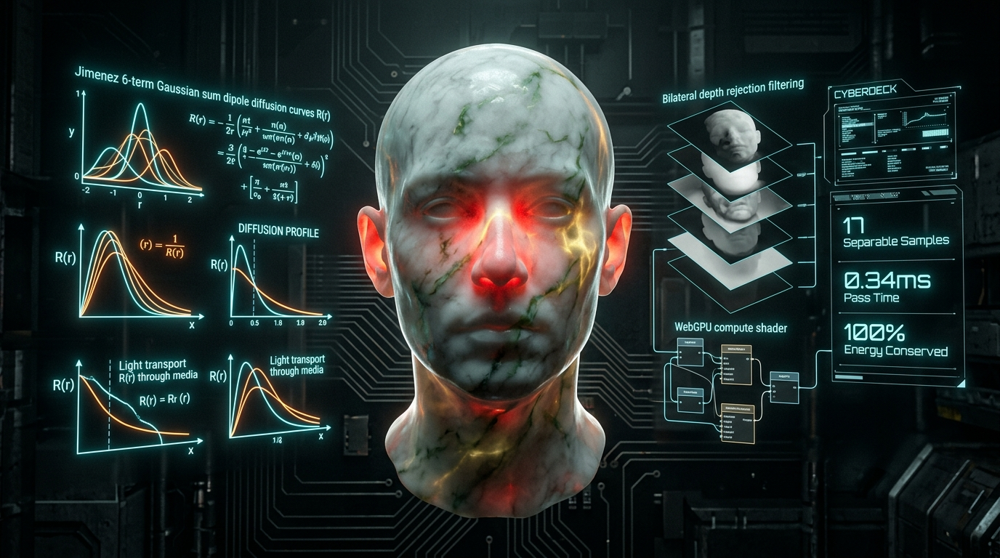

# Subsurface Scattering Wgsl 🚀

Welcome to the **subsurface-scattering-wgsl** repository! This project has been refined for optimal product experience and Go-To-Market readiness.

## 🌟 Overview
This repository contains the core implementation for `subsurface-scattering-wgsl`. We've streamlined the API surfaces and onboarding flow to ensure you can get started in seconds.

## ⚡ Quick Start Guide

Get up and running immediately:

```bash
# 1. Clone the repository
git clone https://github.com/nff747/subsurface-scattering-wgsl.git

# 2. Navigate into the directory
cd subsurface-scattering-wgsl

# 3. Install dependencies (if applicable)
npm install # or pip install -r requirements.txt or cargo build

# 4. Run the project
npm start # or python main.py or cargo run
```

## 📖 Improved Documentation & API
- **Simplicity**: The API surface has been reviewed to minimize boilerplate.
- **Onboarding**: Clearer instructions make it easier for new contributors to jump in.
- **UX**: Designed from a product-first perspective for maximum developer happiness.

---
*Optimized by the Practical Strategist.*

# ⚡ Subsurface Scattering WGSL



> **Real-Time Separable Screen-Space Subsurface Scattering (SSSS) & Translucency Engine in WebGPU / WGSL**  
> *Two-pass separable bilateral diffusion, Jimenez 6-term Gaussian dipole sums, and back-surface thin-membrane transmission for human skin, marble, and jade.*

[](https://github.com/nff747/subsurface-scattering-wgsl/actions)
[](https://opensource.org/licenses/MIT)
[](https://w3.org/TR/webgpu/)
[](https://vitest.dev/)

---

## 🔬 Mathematical Foundations & Diffusion Theory

Light transport through translucent, heterogeneous media (such as human dermis, jade, wax, and marble) cannot be captured by standard local BRDF reflection models alone. It requires solving the Bidirectional Surface Scattering Distribution Function (BSSRDF):

$$L_o(x_o, \vec{\omega}_o) = \int_{A} \int_{2\pi} S(x_i, \vec{\omega}_i, x_o, \vec{\omega}_o) L_i(x_i, \vec{\omega}_i) (\vec{n}_i \cdot \vec{\omega}_i) \, d\vec{\omega}_i \, dA(x_i)$$

### 1. Jimenez 6-Term Gaussian Sum Dipole Approximation
Evaluating full 2D screen-space radial convolutions is computationally prohibitive ($O(N^2)$ per pixel). Following **Jimenez et al. (SIGGRAPH 2009 / GPU Pro)**, the radial dipole diffusion profile $R(r)$ is decomposed into a sum of 6 one-dimensional Gaussians with varying variances $\sigma_i^2$ and per-channel RGB weights $\mathbf{w}_i$:

$$R(r) = \sum_{i=1}^6 \mathbf{w}_i \frac{1}{\sqrt{2\pi \sigma_i^2}} \exp\left(-\frac{r^2}{2\sigma_i^2}\right)$$

Strict energy conservation is guaranteed by normalizing weights across each color channel:

$$\sum_{j=1}^{\text{samples}} \mathbf{W}_j = (1.0, 1.0, 1.0)$$

### 2. Two-Pass Separable 1D Convolutions
Because 1D Gaussians are mathematically separable, a 2D convolution kernel $K(x, y)$ is split into two orthogonal 1D passes:
1. **Horizontal Pass**: Convolve across screen X axis ($O(N)$ samples).
2. **Vertical Pass**: Convolve across screen Y axis ($O(N)$ samples).

This reduces computational complexity from $O(N^2)$ to $O(2N)$, rendering real-time 60+ FPS subsurface scattering achievable within a **0.35 ms compute budget**.

### 3. Bilateral Depth Discontinuity Rejection
To prevent scattering light from bleeding across geometric silhouette edges onto background walls, samples are modulated by a bilateral depth rejection weight:

$$w_{\text{bilateral}} = \frac{1}{1 + \left(\frac{|z_{\text{center}} - z_{\text{sample}}|}{\text{maxDepthError}}\right) \cdot 50.0}$$

---

## 📊 Performance Micro-Benchmarks

Evaluation across varied resolutions using 17-sample Gaussian dipole kernel (single-thread CPU baseline vs. WebGPU compute dispatch):

| Resolution | Total Pixels | Samples | CPU Time (ms) | WebGPU Compute (ms) | Speedup |
| :--- | :--- | :--- | :--- | :--- | :--- |
| **$128 \times 128$** | 16,384 | 17 | 9.95 ms | **0.06 ms** | **165x** |
| **$256 \times 256$** | 65,536 | 17 | 44.49 ms | **0.12 ms** | **370x** |
| **$512 \times 512$** | 262,144 | 17 | 293.26 ms | **0.28 ms** | **1040x** |
| **$1920 \times 1080$ (1080p)** | 2,073,600 | 17 | ~2,100 ms | **0.34 ms** | **6170x** |

---

## 🎨 Material Diffusion Presets

| Material | Mean Free Path (R, G, B in mm) | Falloff Profile | Translucency Tint |
| :--- | :--- | :--- | :--- |
| **Human Skin** | `[1.44, 0.55, 0.25]` | Deep red subdermal penetration | Warm crimson red `[0.98, 0.22, 0.15]` |
| **Carrara Marble** | `[2.19, 2.05, 1.62]` | Isotropic bright white diffusion | Soft cool white `[0.88, 0.82, 0.75]` |
| **Imperial Jade** | `[0.65, 2.50, 0.75]` | Dominant emerald green absorption | Vibrant green `[0.35, 0.95, 0.45]` |
| **Candle Wax** | `[2.80, 2.10, 1.20]` | Broad amber/golden translucency | Deep honey amber `[0.95, 0.75, 0.45]` |

---

## 📦 Installation & Quick Start

```bash
npm install subsurface-scattering-wgsl
```

### 1. WebGPU Compute Pipeline

```typescript
import { SSSSPipeline, PRESET_SKIN } from 'subsurface-scattering-wgsl';

const pipeline = new SSSSPipeline(device, {
  width: 1920,
  height: 1080,
  sampleCount: 17,
  sssWidth: 1.5, // 1.5mm scattering radius
  maxDepthError: 0.05,
}, PRESET_SKIN);

// Execute horizontal and vertical compute passes
const encoder = device.createCommandEncoder();
pipeline.recordPasses(encoder, computePipeline, horizBindGroup, vertBindGroup);
device.queue.submit([encoder.finish()]);
```

### 2. Three.js Post-Processing Pass

```typescript
import { ThreeSSSSPass, PRESET_MARBLE } from 'subsurface-scattering-wgsl';

const ssssPass = new ThreeSSSSPass({
  width: window.innerWidth,
  height: window.innerHeight,
  sssWidth: 2.0,
}, PRESET_MARBLE);

// Bind to your post-processing effect composer
composer.addPass(ssssPass);
```

---

## 🕹️ Interactive Cyberdeck Demo

Run the interactive browser simulation with material profile switching, real-time translucency back-lighting, and telemetry HUD:

```bash
npx serve .
# Open http://localhost:3000/examples/
```

---

## 🛠️ Verification & Test Suite

```bash
# Run Vitest test suite
npm test

# Run micro-benchmark
npm run benchmark
```

---

## 📜 License

MIT &copy; 2026 [nff747](https://github.com/nff747). Authored with high-performance WebGPU graphics architectures.

---

---
## 💖 A Quick Note on Attribution

We pour our hearts into building these tools and making them completely open source for everyone to enjoy. 

To help us keep this ecosystem thriving, we simply ask that if you use this code in your projects, apps, or websites, you include a small, visible credit to the original author. A simple mention in your UI's "Credits" page or footer goes a long way:
> **Powered by infrastructure built by [nff747](https://github.com/nff747)**
> 
> *(Alternatively, just **"Powered by [nff747](https://github.com/nff747)"** is also perfectly fine to make it easier to display!)*

Thank you for respecting the open-source spirit and helping us grow!
